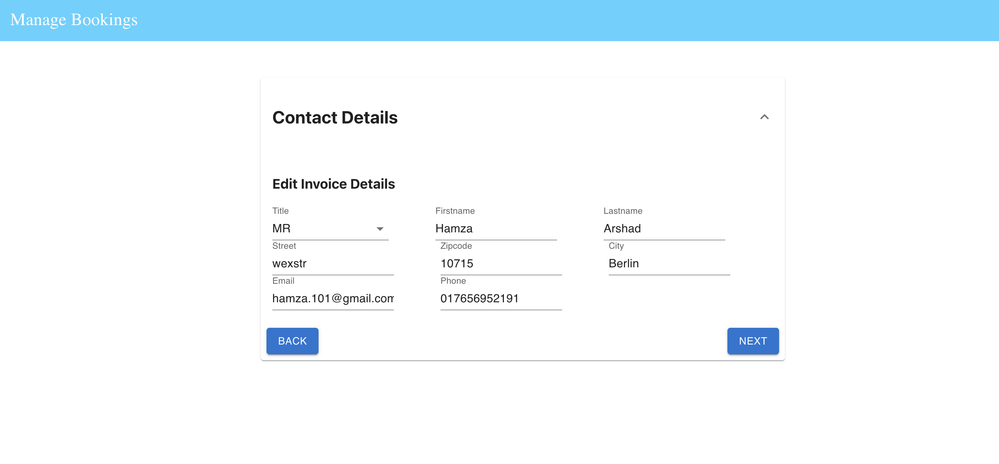

## What I undertand from the task?

- We need to update the passenger's booking details and we can update only once.

## The schema stucture that I kept in my mind while implementing the task.

- In my mind I had the three collections to implement the flight booking system. There collections are as follows
  - Passenger =>{id, title, firstName, lastName, address, contactNumbe, etc }
  - Flight => {id, departure, arrival, depatureTime, arrivalTime, passengerCapacity, planeId}
  - Flight booking => { id, passengerId,flightId, seatNumber, checkinBags, handBags, weithLimit, }

### ER Diagram

### How we can run the Back end

Please refer to the following readme to run the backend - https://github.com/Hamzaarshad1/assignment/tree/main/backend#readme

### How we can run the Back end

Please refer to the following readme to run the backend - https://github.com/Hamzaarshad1/assignment/tree/main/backend#readme

### Backend related Improvements

- There are few things I would love to do for the backend
  - Currently autorization is missing would love to implement that.
  - Would love to add the the read and write permissions.
  - Because of the limited time I used the express for I would be more happy if I get enogh time time implement it using serverless frameworks.

